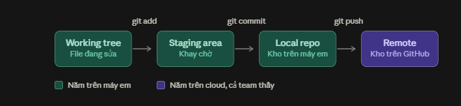

# Buổi 1 · Setup môi trường & TypeScript cơ bản


**Sau buổi này bạn sẽ:** có một project TypeScript chạy được trên máy của mình, viết được hàm có khai báo kiểu dữ liệu, và sử dụng được destructuring, cú pháp xuất hiện trong mọi test Playwright.


## 1. Chuẩn bị trước buổi học

Cài đầy đủ các công cụ sau trước khi bắt đầu:

| Công cụ | Phiên bản tối thiểu           | Link tải                                                 | Cách kiểm tra    |
| ------- | ----------------------------- | -------------------------------------------------------- | ---------------- |
| Node.js | 22.x trở lên (nên dùng LTS)   | [nodejs.org/en/download](https://nodejs.org/en/download) | `node -v`        |
| npm     | 10.x trở lên (đi kèm Node.js) | Cài cùng Node.js                                         | `npm -v`         |
| Git     | Mới nhất                      | [git-scm.com/downloads](https://git-scm.com/downloads)   | `git --version`  |
| VS Code | Mới nhất                      | [code.visualstudio.com](https://code.visualstudio.com)   | Mở được ứng dụng |


**Chọn bản Node.js:** ở trang tải, chọn bản LTS (Long Term Support) vì đây là bản ổn định nhất. npm được cài tự động kèm Node.js nên không cần cài riêng. Git chỉ cần cài sẵn trong buổi này, cách dùng Git được trình bày ở Buổi 2.


**Extensions cho VS Code:** mở VS Code, nhấn `Ctrl+Shift+X` (macOS: `Cmd+Shift+X`), tìm và cài:

1. **ESLint**: phát hiện lỗi và code chưa đúng chuẩn.
2. **Prettier**: tự động format code.
3. **Playwright Test for VSCode**: dùng từ Buổi 4.

## 2. Tạo project cho khóa học

Toàn bộ khóa học sử dụng một project duy nhất tên `playwright-course`. Trong Phase 1, bài của mỗi buổi nằm trong một folder con (`lesson-01`, `lesson-02`, `lesson-03`). Từ Buổi 4, Playwright được cài thêm vào chính project này. Cách tổ chức này tương tự project thực tế: thư viện được cài đặt tại gốc project và dùng chung cho toàn bộ file bên trong.

### Bước 1: tạo folder project và mở bằng VS Code

1. Tạo folder `playwright-course` ở vị trí dễ tìm (ví dụ Documents) bằng File Explorer (Windows) hoặc Finder (macOS).
2. Mở VS Code, chọn menu File > Open Folder, chọn folder vừa tạo. Khung Explorer bên trái hiển thị nội dung project (hiện đang trống).
3. Mở terminal bằng menu Terminal > New Terminal. Terminal tự động đứng tại gốc project. Mọi lệnh trong khóa học đều chạy từ vị trí này.



### Bước 2: khởi tạo project và cài thư viện

Chạy lần lượt 2 lệnh sau trong terminal:

```bash
npm init -y
npm install typescript tsx @types/node --save-dev
```

| Lệnh                                                | Ý nghĩa                                                                                                                                                                                                                  |
| --------------------------------------------------- | ------------------------------------------------------------------------------------------------------------------------------------------------------------------------------------------------------------------------ |
| `npm init -y`                                       | Tạo file `package.json` tại folder terminal đang đứng, nơi ghi tên project và danh sách thư viện đã cài                                                                                                                  |
| `npm install typescript tsx @types/node --save-dev` | Cài 3 thư viện: `typescript` (bộ kiểm tra kiểu dữ liệu), `tsx` (công cụ chạy trực tiếp file .ts) và `@types/node` (mô tả kiểu cho các API có sẵn của Node.js). Cờ `--save-dev` đánh dấu thư viện chỉ dùng khi phát triển |

Sau 2 lệnh này, Explorer hiển thị thêm `package.json`, `package-lock.json` và folder `node_modules/`.

### Bước 3: tạo file cấu hình

Trong Explorer, chuột phải vào vùng trống của project, chọn **New File**, tạo 2 file sau ở gốc project. Nội dung cần sao chép chính xác, kể cả dấu phẩy cuối mỗi dòng.

File `tsconfig.json`:

```json
{
  "compilerOptions": {
    "target": "ESNext",
    "module": "ESNext",
    "moduleResolution": "bundler",
    "strict": true,
    "moduleDetection": "force",
    "skipLibCheck": true,
    "types": ["node"]
  }
}
```

| Dòng                                                  | Ý nghĩa                                                                                                       |
| ----------------------------------------------------- | ------------------------------------------------------------------------------------------------------------- |
| `"target": "ESNext"`                                  | Cho phép dùng các cú pháp JavaScript mới nhất                                                                 |
| `"module": "ESNext"`, `"moduleResolution": "bundler"` | Cách TypeScript xử lý `import` và `export` giữa các file (dùng ở Buổi 3)                                      |
| `"strict": true`                                      | Bật toàn bộ kiểm tra kiểu nghiêm ngặt                                                                         |
| `"moduleDetection": "force"`                          | Coi mỗi file là một module riêng, để hai file trong project cùng khai báo `const user` không bị báo trùng tên |
| `"skipLibCheck": true`                                | Không kiểm tra kiểu bên trong `node_modules/`, giúp VS Code phản hồi nhanh và tránh lỗi phát sinh từ thư viện |
| `"types": ["node"]`                                   | Nạp mô tả kiểu của Node.js từ `@types/node` (cần cho `playwright.config.ts` ở Buổi 4)                         |

File `.gitignore` (tên file bắt đầu bằng dấu chấm, không có phần mở rộng):

```
node_modules/
```

File này báo cho Git bỏ qua folder `node_modules/` khi đưa project lên GitHub ở Buổi 2. Thư viện không cần lưu lên GitHub vì có thể cài lại bằng `npm install` dựa trên `package.json`.

### Bước 4: tạo folder bài học và file đầu tiên

1. Trong Explorer, chuột phải vào vùng trống của project, chọn **New Folder**, đặt tên `lesson-01`.
2. Chuột phải vào folder `lesson-01`, chọn **New File**, đặt tên `hello.ts`, nội dung:

```typescript
const courseName: string = "Automation Testing từ Zero đến Hero";
const sessionNumber: number = 1;

console.log(`Chào mừng đến với ${courseName}, buổi ${sessionNumber}`);
```

### Cấu trúc project sau khi hoàn tất

```
playwright-course/
├── node_modules/
├── lesson-01/
│   └── hello.ts
├── .gitignore
├── package.json
├── package-lock.json
└── tsconfig.json
```

| File / folder       | Cách tạo | Vai trò                                                                                       |
| ------------------- | -------- | --------------------------------------------------------------------------------------------- |
| `node_modules/`     | npm      | Code của các thư viện đã cài. Không sửa tay, không đưa lên Git                                |
| `lesson-01/`        | Thủ công | Folder chứa toàn bộ file của Buổi 1. Buổi 2 và 3 có folder tương ứng `lesson-02`, `lesson-03` |
| `.gitignore`        | Thủ công | Danh sách file và folder Git bỏ qua                                                           |
| `package.json`      | npm      | Tên project và danh sách thư viện                                                             |
| `package-lock.json` | npm      | Phiên bản chính xác của từng thư viện đã cài. Không sửa tay                                   |
| `tsconfig.json`     | Thủ công | Cấu hình TypeScript                                                                           |

### Bước 5: chạy file

Chạy từ gốc project, ghi đường dẫn đầy đủ tới file:

```bash
npx tsx lesson-01/hello.ts
```

Kết quả mong đợi trên terminal:

```
Chào mừng đến với Automation Testing từ Zero đến Hero, buổi 1
```


`npx` chạy một công cụ đã cài trong `node_modules/` của project mà không cần cài toàn cục. Nếu terminal in ra đúng dòng trên, bạn đã chạy thành công chương trình TypeScript đầu tiên.


## 3. TypeScript là gì

TypeScript = JavaScript + kiểu dữ liệu

TypeScript là JavaScript có bổ sung hệ thống kiểu dữ liệu (type). Khi một biến được khai báo là `string`, TypeScript báo lỗi ngay nếu biến đó bị gán một số, trước khi chương trình chạy.

Thử trực tiếp: thêm vào cuối `hello.ts` dòng `const wrongNumber: number = "hai";`. VS Code gạch đỏ ngay với thông báo `Type 'string' is not assignable to type 'number'`. Với tester, đây là nguyên tắc quen thuộc: phát hiện lỗi càng sớm, chi phí sửa càng thấp. Playwright chọn TypeScript làm ngôn ngữ mặc định cũng vì lý do này. Xóa dòng thử nghiệm trước khi tiếp tục.

## 4. Biến và kiểu dữ liệu

```typescript
// const: không gán lại được, dùng cho hầu hết trường hợp
const appUrl: string = "https://www.saucedemo.com";

// let: có thể gán lại, chỉ dùng khi giá trị thực sự thay đổi
let retryCount: number = 0;
retryCount = 1; // OK

const isLoggedIn: boolean = false;
```


**Tránh dùng kiểu `any`.** Khai báo `any` tương đương với tắt kiểm tra kiểu cho biến đó, và bạn mất toàn bộ lợi ích của TypeScript. Chỉ dùng khi không còn cách nào khác.


## 5. Function và Arrow function

Có 2 cách viết hàm. Cả hai đều khai báo kiểu cho tham số và giá trị trả về:

```typescript
// Cách 1: function truyền thống
function add(a: number, b: number): number {
  return a + b;
}

// Cách 2: arrow function, cú pháp được dùng trong mọi test Playwright
const multiply = (a: number, b: number): number => {
  return a * b;
};

console.log(add(2, 3));      // 5
console.log(multiply(2, 3)); // 6
```

Hai cách gần như tương đương ở giai đoạn này. Điểm cần ghi nhớ là ký hiệu `=>`, vì mọi test Playwright đều được viết bằng arrow function.

## 6. Array và Object

```typescript
// Array: danh sách các giá trị cùng kiểu
const browsers: string[] = ["chromium", "firefox", "webkit"];
browsers.push("edge");        // thêm phần tử vào cuối
console.log(browsers.length); // 4

// Duyệt qua từng phần tử
for (const browser of browsers) {
  console.log(`Đang test trên: ${browser}`);
}

// Object: nhóm nhiều thông tin liên quan vào một chỗ
const user = {
  username: "standard_user",
  password: "secret_sauce",
  role: "customer",
};
console.log(user.username);
```

## 7. Destructuring

Destructuring là cú pháp lấy nhiều field ra khỏi object và gán vào các biến riêng trong một câu lệnh:

```typescript
const user = {
  username: "standard_user",
  password: "secret_sauce",
};

// Cách cũ: lấy từng field một
const usernameOld = user.username;
const passwordOld = user.password;

// Destructuring: lấy nhiều field cùng lúc, tên biến trùng với tên field
const { username, password } = user;
console.log(username); // "standard_user"
```


**Liên hệ với Playwright:** ở Buổi 4, bạn sẽ viết dòng `test("login", async ({ page }) => {...})`. Phần `{ page }` chính là destructuring: Playwright truyền vào một object chứa nhiều công cụ, và test chỉ lấy ra `page`. Từ khóa `async` được giải thích ở Buổi 2.


## 8. Quy tắc đặt tên (Coding convention)

| Loại      | Quy tắc                   | Đúng                             | Sai                            |
| --------- | ------------------------- | -------------------------------- | ------------------------------ |
| Biến, hàm | camelCase                 | `getUserData`                    | `GetUserData`, `get_user_data` |
| Tên biến  | Có ý nghĩa, tự giải thích | `loginButton`, `productPrice`    | `data`, `temp`, `a`, `b`       |
| Comment   | Giải thích lý do          | `// retry 3 lần vì API hay chậm` | `// gán x bằng 3`              |

Code đặt tên tốt là code người khác đọc hiểu mà không cần giải thích thêm. Trainer sẽ review tiêu chí này trong mọi bài nộp.

## 9. Lỗi thường gặp

| Triệu chứng                                       | Nguyên nhân                                               | Cách xử lý                                                                                                     |
| ------------------------------------------------- | --------------------------------------------------------- | -------------------------------------------------------------------------------------------------------------- |
| Gõ `node -v` báo không tìm thấy lệnh              | Terminal được mở trước khi cài Node.js                    | Đóng và mở lại terminal, hoặc khởi động lại VS Code                                                            |
| `npm init` hoặc `npm install` tạo file ở sai chỗ  | Terminal không đứng ở gốc project                         | Kiểm tra bằng `pwd`. Nếu sai, dùng File > Open Folder chọn `playwright-course` rồi mở terminal mới             |
| `npx tsx` báo không tìm thấy file                 | Thiếu tiền tố folder trong đường dẫn                      | Chạy từ gốc project với đường dẫn đầy đủ, ví dụ `npx tsx lesson-01/hello.ts`                                   |
| VS Code gạch đỏ ngay trong `tsconfig.json`        | JSON sai cú pháp: thiếu dấu phẩy, dấu ngoặc hoặc dấu nháy | So sánh từng dòng với nội dung ở mục 2. Mỗi dòng trong `compilerOptions` kết thúc bằng dấu phẩy, trừ dòng cuối |
| Lỗi "Cannot find type definition file for 'node'" | Chưa cài `@types/node`                                    | Chạy lại `npm install typescript tsx @types/node --save-dev`                                                   |
| Gạch đỏ "Cannot redeclare block-scoped variable"  | Thiếu `tsconfig.json` hoặc thiếu dòng `moduleDetection`   | Kiểm tra `tsconfig.json` ở gốc project có đúng nội dung ở mục 2                                                |
| VS Code không gạch đỏ khi sai kiểu                | File chưa lưu hoặc chưa cài đủ extension                  | Lưu file (`Ctrl+S`), kiểm tra lại mục 1                                                                        |

## 10. Bài tập về nhà (45-60 phút)

Tạo file `lesson-01/homework-lesson-01.ts` và viết các hàm sau, đặt tên đúng convention:

1. `isValidPassword(password: string): boolean`: trả về `true` khi password có từ 8 ký tự trở lên.
2. `getDiscountPrice(price: number, percent: number): number`: tính giá sau khi giảm.
3. `formatUserInfo(user: { name: string; age: number }): string`: trả về chuỗi dạng `"Linh (25 tuổi)"`, bắt buộc dùng destructuring trong thân hàm.
4. (Không bắt buộc) Hàm nhận một mảng số và trả về số lớn nhất.

Chạy thử từng hàm bằng `console.log` và lệnh `npx tsx lesson-01/homework-lesson-01.ts`. Toàn bộ project `playwright-course` được đưa lên repo lớp ở Buổi 2, sau khi học Git, và nộp cùng bài tập Buổi 2 qua Pull Request trên nhánh `your-name/lesson-2`.

**Checklist trước khi nộp:** file chạy được bằng `npx tsx lesson-01/homework-lesson-01.ts` · mọi tham số và giá trị trả về đều có khai báo kiểu · không dùng `any` · tên hàm và biến đúng camelCase · hàm số 3 có dùng destructuring.
