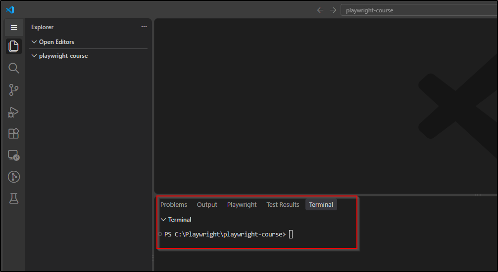

# Buổi 1 · Setup môi trường & TypeScript cơ bản


**Sau buổi này bạn sẽ:** có một project TypeScript chạy được trên máy của mình, viết được hàm có khai báo kiểu dữ liệu và tham số tùy chọn, dùng được toán tử, câu lệnh if / else và vòng lặp để xử lý dữ liệu test, và sử dụng được destructuring, cú pháp xuất hiện trong mọi test Playwright.


## 1. Chuẩn bị trước buổi học

Cài đầy đủ các công cụ sau trước khi bắt đầu:

| Công cụ | Phiên bản tối thiểu           | Link tải                                                 | Cách kiểm tra    |
| ------- | ----------------------------- | -------------------------------------------------------- | ---------------- |
| Node.js | 22.x trở lên (nên dùng LTS)   | [nodejs.org/en/download](https://nodejs.org/en/download) | `node -v`        |
| npm     | 10.x trở lên (đi kèm Node.js) | Cài cùng Node.js                                         | `npm -v`         |
| Git     | Mới nhất                      | [git-scm.com/downloads](https://git-scm.com/downloads)   | `git --version`  |
| VS Code | Mới nhất                      | [code.visualstudio.com](https://code.visualstudio.com)   | Mở được ứng dụng |


**Chọn bản Node.js:** ở trang tải, chọn bản LTS (Long Term Support) vì đây là bản ổn định nhất. npm được cài tự động kèm Node.js nên không cần cài riêng. Git chỉ cần cài sẵn trong buổi này, cách dùng Git được trình bày ở Buổi 2.


**Extensions cho VS Code:** mở VS Code, nhấn `Ctrl+Shift+X` (macOS: `Cmd+Shift+X`), tìm và cài:

1. **ESLint**: phát hiện lỗi và code chưa đúng chuẩn.
2. **Prettier**: tự động format code.
3. **Playwright Test for VSCode**: dùng từ Buổi 4.

## 2. Tạo project cho khóa học

Toàn bộ khóa học sử dụng một project duy nhất tên `playwright-course`. Trong Phase 1, bài của mỗi buổi nằm trong một folder con (`lesson-01`, `lesson-02`, `lesson-03`). Từ Buổi 4, Playwright được cài thêm vào chính project này. Cách tổ chức này tương tự project thực tế: thư viện được cài đặt tại gốc project và dùng chung cho toàn bộ file bên trong.

### Bước 1: tạo folder project và mở bằng VS Code

1. Tạo folder `playwright-course` ở vị trí dễ tìm (ví dụ Documents) bằng File Explorer (Windows) hoặc Finder (macOS).
2. Mở VS Code, chọn menu File > Open Folder, chọn folder vừa tạo. Khung Explorer bên trái hiển thị nội dung project (hiện đang trống).
3. Mở terminal bằng menu Terminal > New Terminal. Terminal tự động đứng tại gốc project. Mọi lệnh trong khóa học đều chạy từ vị trí này.



### Bước 2: khởi tạo project và cài thư viện

Chạy lần lượt 2 lệnh sau trong terminal:

```bash
npm init -y
npm install typescript tsx @types/node --save-dev
```

| Lệnh                                                | Ý nghĩa                                                                                                                                                                                                                  |
| --------------------------------------------------- | ------------------------------------------------------------------------------------------------------------------------------------------------------------------------------------------------------------------------ |
| `npm init -y`                                       | Tạo file `package.json` tại folder terminal đang đứng, nơi ghi tên project và danh sách thư viện đã cài                                                                                                                  |
| `npm install typescript tsx @types/node --save-dev` | Cài 3 thư viện: `typescript` (bộ kiểm tra kiểu dữ liệu), `tsx` (công cụ chạy trực tiếp file .ts) và `@types/node` (mô tả kiểu cho các API có sẵn của Node.js). Cờ `--save-dev` đánh dấu thư viện chỉ dùng khi phát triển |

Sau 2 lệnh này, Explorer hiển thị thêm `package.json`, `package-lock.json` và folder `node_modules/`.

### Bước 3: tạo file cấu hình

Trong Explorer, chuột phải vào vùng trống của project, chọn **New File**, tạo 2 file sau ở gốc project. Nội dung cần sao chép chính xác, kể cả dấu phẩy cuối mỗi dòng.

File `tsconfig.json`:

```json
{
  "compilerOptions": {
    "target": "ESNext",
    "module": "ESNext",
    "moduleResolution": "bundler",
    "strict": true,
    "moduleDetection": "force",
    "skipLibCheck": true,
    "types": ["node"]
  }
}
```

| Dòng                                                  | Ý nghĩa                                                                                                       |
| ----------------------------------------------------- | ------------------------------------------------------------------------------------------------------------- |
| `"target": "ESNext"`                                  | Cho phép dùng các cú pháp JavaScript mới nhất                                                                 |
| `"module": "ESNext"`, `"moduleResolution": "bundler"` | Cách TypeScript xử lý `import` và `export` giữa các file (dùng ở Buổi 3)                                      |
| `"strict": true`                                      | Bật toàn bộ kiểm tra kiểu nghiêm ngặt                                                                         |
| `"moduleDetection": "force"`                          | Coi mỗi file là một module riêng, để hai file trong project cùng khai báo `const user` không bị báo trùng tên |
| `"skipLibCheck": true`                                | Không kiểm tra kiểu bên trong `node_modules/`, giúp VS Code phản hồi nhanh và tránh lỗi phát sinh từ thư viện |
| `"types": ["node"]`                                   | Nạp mô tả kiểu của Node.js từ `@types/node` (cần cho `playwright.config.ts` ở Buổi 4)                         |

File `.gitignore` (tên file bắt đầu bằng dấu chấm, không có phần mở rộng):

```
node_modules/
```

File này báo cho Git bỏ qua folder `node_modules/` khi đưa project lên GitHub ở Buổi 2. Thư viện không cần lưu lên GitHub vì có thể cài lại bằng `npm install` dựa trên `package.json`.

### Bước 4: tạo folder bài học và file đầu tiên

1. Trong Explorer, chuột phải vào vùng trống của project, chọn **New Folder**, đặt tên `lesson-01`.
2. Chuột phải vào folder `lesson-01`, chọn **New File**, đặt tên `hello.ts`, nội dung:

```typescript
const courseName: string = "Automation Testing từ Zero đến Hero";
const sessionNumber: number = 1;

console.log(`Chào mừng đến với ${courseName}, buổi ${sessionNumber}`);
```

### Cấu trúc project sau khi hoàn tất

```
playwright-course/
├── node_modules/
├── lesson-01/
│   └── hello.ts
├── .gitignore
├── package.json
├── package-lock.json
└── tsconfig.json
```

| File / folder       | Cách tạo | Vai trò                                                                                       |
| ------------------- | -------- | --------------------------------------------------------------------------------------------- |
| `node_modules/`     | npm      | Code của các thư viện đã cài. Không sửa tay, không đưa lên Git                                |
| `lesson-01/`        | Thủ công | Folder chứa toàn bộ file của Buổi 1. Buổi 2 và 3 có folder tương ứng `lesson-02`, `lesson-03` |
| `.gitignore`        | Thủ công | Danh sách file và folder Git bỏ qua                                                           |
| `package.json`      | npm      | Tên project và danh sách thư viện                                                             |
| `package-lock.json` | npm      | Phiên bản chính xác của từng thư viện đã cài. Không sửa tay                                   |
| `tsconfig.json`     | Thủ công | Cấu hình TypeScript                                                                           |

### Bước 5: chạy file

Chạy từ gốc project, ghi đường dẫn đầy đủ tới file:

```bash
npx tsx lesson-01/hello.ts
```

Kết quả mong đợi trên terminal:

```
Chào mừng đến với Automation Testing từ Zero đến Hero, buổi 1
```


`npx` chạy một công cụ đã cài trong `node_modules/` của project mà không cần cài toàn cục. Nếu terminal in ra đúng dòng trên, bạn đã chạy thành công chương trình TypeScript đầu tiên.


## 3. TypeScript là gì

TypeScript = JavaScript + kiểu dữ liệu

TypeScript là JavaScript có bổ sung hệ thống kiểu dữ liệu (type). Khi một biến được khai báo là `string`, TypeScript báo lỗi ngay nếu biến đó bị gán một số, trước khi chương trình chạy.

Thử trực tiếp: thêm vào cuối `hello.ts` dòng `const wrongNumber: number = "hai";`. VS Code gạch đỏ ngay với thông báo `Type 'string' is not assignable to type 'number'`. Với tester, đây là nguyên tắc quen thuộc: phát hiện lỗi càng sớm, chi phí sửa càng thấp. Playwright chọn TypeScript làm ngôn ngữ mặc định cũng vì lý do này. Xóa dòng thử nghiệm trước khi tiếp tục.


**Cách chạy thử các ví dụ trong bài:** tạo file `lesson-01/practice.ts`, dán đoạn code cần thử vào rồi chạy `npx tsx lesson-01/practice.ts`. Mỗi khối code từ mục 4 trở đi là một ví dụ độc lập. Khi dán nhiều ví dụ vào cùng một file, đổi tên các biến bị trùng (ví dụ `user`, `browsers`), vì TypeScript không cho phép khai báo hai biến cùng tên trong một file.


## 4. Biến và kiểu dữ liệu

```typescript
// const: không gán lại được, dùng cho hầu hết trường hợp
const appUrl: string = "https://www.saucedemo.com";

// let: có thể gán lại, chỉ dùng khi giá trị thực sự thay đổi
let retryCount: number = 0;
retryCount = 1; // OK

const isLoggedIn: boolean = false;
```


**Tránh dùng kiểu `any`.** Khai báo `any` tương đương với tắt kiểm tra kiểu cho biến đó, và bạn mất toàn bộ lợi ích của TypeScript. Chỉ dùng khi không còn cách nào khác.


## 5. Toán tử so sánh và toán tử logic

Toán tử so sánh và toán tử logic tạo ra các điều kiện có giá trị `boolean`. Điều kiện được dùng trong câu lệnh `if` (mục 6), trong vòng lặp (mục 9), và là nền tảng của mọi assertion: so sánh giá trị thực tế (actual) với giá trị mong đợi (expected).

### Toán tử quan hệ (relational operators)

So sánh độ lớn của hai giá trị bằng `<`, `>`, `<=`, `>=`. Kết quả luôn là `boolean`:

```typescript
const itemCount: number = 6;
const maxItems: number = 6;

console.log(itemCount < maxItems);  // false
console.log(itemCount >= maxItems); // true
console.log(itemCount > 3);         // true
console.log(itemCount <= 5);        // false
```

### Toán tử bằng (equality operators)

| Toán tử    | Ý nghĩa                                                                                       | Ví dụ      | Kết quả |
| ---------- | --------------------------------------------------------------------------------------------- | ---------- | ------- |
| `===`      | Bằng: cùng giá trị và cùng kiểu (strict equality)                                             | `5 === 5`  | `true`  |
| `!==`      | Khác                                                                                          | `5 !== 5`  | `false` |
| `==`, `!=` | Bằng, khác nhưng tự chuyển kiểu trước khi so sánh (loose equality). Không dùng trong khóa học | `5 == "5"` | `true`  |

```typescript
const actualTitle: string = "Products";
const expectedTitle: string = "Products";

console.log(actualTitle === expectedTitle); // true
console.log(actualTitle !== expectedTitle); // false
console.log(actualTitle === "products");    // false, so sánh chuỗi phân biệt chữ hoa chữ thường
```


**Luôn dùng `===` và `!==`, không dùng `==` và `!=`.** Cặp `==` và `!=` tự chuyển kiểu trước khi so sánh, nên `5 == "5"` cho kết quả `true` dù một bên là số và một bên là chuỗi. Cách so sánh này dễ tạo ra lỗi khó phát hiện. TypeScript báo lỗi khi so sánh hai giá trị khác kiểu, nên ví dụ `5 == "5"` chỉ chạy được trong JavaScript thuần. Quy ước của khóa học là chỉ dùng `===` và `!==`.


### Toán tử logic (logical operators)

Toán tử logic kết hợp nhiều điều kiện `boolean` thành một điều kiện: `&&` (AND), `||` (OR), `!` (NOT).

| Toán tử  | Đọc là   | Kết quả `true` khi           |
| -------- | -------- | ---------------------------- |
| `&&`     | và       | cả hai vế đều `true`         |
| `\|\|`   | hoặc     | ít nhất một vế `true`        |
| `!`      | phủ định | giá trị phía sau là `false`  |

```typescript
const isLoggedIn: boolean = true;
const hasItemsInCart: boolean = false;

console.log(isLoggedIn && hasItemsInCart); // false: cả hai vế phải true
console.log(isLoggedIn || hasItemsInCart); // true: chỉ cần một vế true
console.log(!isLoggedIn);                  // false: đảo ngược giá trị

// Kết hợp toán tử so sánh và toán tử logic
const password: string = "secret_sauce";
const isStrongPassword = password.length >= 8 && password !== "password";
console.log(isStrongPassword); // true
```

`password.length` là số ký tự của chuỗi. Biểu thức `isStrongPassword` đọc là: password có từ 8 ký tự trở lên **và** khác chuỗi `"password"`.


**Liên hệ với Playwright:** từ Buổi 4, các phép so sánh trong test được viết bằng assertion `expect`, ví dụ `expect(user.name).toBe("Leanne Graham")` ở Buổi 11. Bản chất vẫn là phép so sánh `===` giữa giá trị thực tế và giá trị mong đợi, nhưng khi sai, Playwright in ra cả hai giá trị để dễ tìm nguyên nhân.


## 6. Câu lệnh điều kiện if / else

Câu lệnh `if` chạy một khối lệnh khi điều kiện là `true`. Khối `else` (không bắt buộc) chạy khi điều kiện là `false`:

```typescript
const statusCode: number = 200;

if (statusCode === 200) {
  console.log("Request thành công");
} else {
  console.log("Request thất bại");
}
```

| Thành phần                | Ý nghĩa                                                                                                          |
| ------------------------- | ---------------------------------------------------------------------------------------------------------------- |
| `if (statusCode === 200)` | Điều kiện đặt trong ngoặc tròn, là một biểu thức trả về `boolean` (thường dùng toán tử so sánh và logic ở mục 5) |
| `{ ... }` ngay sau `if`   | Khối lệnh chạy khi điều kiện là `true`                                                                           |
| `else { ... }`            | Khối lệnh chạy khi điều kiện là `false`. Có thể bỏ qua nếu không cần xử lý trường hợp sai                        |

### Nhiều nhánh với else if

Khi có nhiều hơn hai trường hợp, dùng `else if`. Các điều kiện được kiểm tra lần lượt từ trên xuống và chỉ nhánh đầu tiên có điều kiện đúng được chạy:

```typescript
const statusCode: number = 404;

if (statusCode >= 200 && statusCode < 300) {
  console.log("Thành công");
} else if (statusCode === 404) {
  console.log("Không tìm thấy resource");
} else if (statusCode >= 500) {
  console.log("Lỗi phía server");
} else {
  console.log(`Mã trạng thái khác: ${statusCode}`);
}
```

Kết quả in ra là `Không tìm thấy resource`: mã 404 không thỏa điều kiện nhánh đầu, thỏa điều kiện nhánh thứ hai, và các nhánh còn lại không được kiểm tra nữa.

### switch: chọn nhánh theo một giá trị cụ thể

Khi cần so sánh một giá trị với nhiều giá trị cụ thể, `switch` dễ đọc hơn chuỗi `else if`. Ví dụ với tên ba browser engine mà Playwright hỗ trợ (Buổi 9 cấu hình chạy test trên cả ba):

```typescript
const browserName: string = "firefox";

switch (browserName) {
  case "chromium":
    console.log("Chạy trên Chrome, Edge và các browser dựa trên Chromium");
    break;
  case "firefox":
    console.log("Chạy trên Firefox");
    break;
  case "webkit":
    console.log("Chạy trên Safari, engine WebKit");
    break;
  default:
    console.log(`Không hỗ trợ browser: ${browserName}`);
}
```

Kết quả in ra là `Chạy trên Firefox`.

| Thành phần             | Ý nghĩa                                                                                                          |
| ---------------------- | ---------------------------------------------------------------------------------------------------------------- |
| `switch (browserName)` | Giá trị cần so sánh                                                                                              |
| `case "firefox":`      | Nhánh chạy khi giá trị bằng (`===`) `"firefox"`                                                                  |
| `break;`               | Kết thúc `switch`. Thiếu `break`, chương trình chạy tiếp sang nhánh `case` kế tiếp dù giá trị không khớp         |
| `default:`             | Nhánh chạy khi không `case` nào khớp, tương tự `else`. Không bắt buộc nhưng nên có để xử lý giá trị ngoài dự kiến |

Quy tắc chọn: dùng `switch` khi so sánh một giá trị với danh sách các giá trị cố định (bằng nhau hoàn toàn). Dùng `else if` khi điều kiện là khoảng giá trị (`statusCode >= 500`) hoặc kết hợp nhiều điều kiện bằng toán tử logic.

### Toán tử ba ngôi: dạng rút gọn của if / else

Khi chỉ cần chọn một trong hai giá trị để gán vào biến, toán tử ba ngôi (ternary operator) viết gọn hơn if / else:

```typescript
const canLogin: boolean = false;

// Cách 1: if / else, phải khai báo biến bằng let rồi gán trong từng nhánh
let expectedResult: string;
if (canLogin) {
  expectedResult = "đăng nhập thành công";
} else {
  expectedResult = "bị từ chối";
}
console.log(expectedResult); // "bị từ chối"

// Cách 2: toán tử ba ngôi, cùng kết quả trong một dòng
const expected = canLogin ? "đăng nhập thành công" : "bị từ chối";
console.log(expected); // "bị từ chối"
```

Cú pháp: `điều kiện ? giá trị khi đúng : giá trị khi sai`. Chỉ dùng toán tử ba ngôi cho việc chọn giữa hai giá trị đơn giản. Khi mỗi nhánh cần nhiều câu lệnh, dùng if / else để code dễ đọc.


**Liên hệ với Playwright:** trong test, if / else xuất hiện ít hơn so với script thông thường, vì việc kiểm tra kết quả được giao cho assertion `expect` (Buổi 6). if / else chủ yếu dùng trong helper function và khi xử lý dữ liệu test, ví dụ chọn kết quả mong đợi theo từng tài khoản ở mục 9.


## 7. Function và Arrow function

Có 2 cách viết hàm. Cả hai đều khai báo kiểu cho tham số và giá trị trả về. Cùng một hàm `add` được viết theo hai cách để so sánh:

```typescript
// Cách 1: function truyền thống
function add(a: number, b: number): number {
  return a + b;
}

console.log(add(2, 3)); // 5
```

```typescript
// Cách 2: arrow function, cú pháp được dùng trong mọi test Playwright
const add = (a: number, b: number): number => {
  return a + b;
};

console.log(add(2, 3)); // 5
```

Hai cách cho kết quả giống nhau. Điểm khác biệt về cú pháp:

| Function truyền thống | Arrow function |
| --- | --- |
| Bắt đầu bằng từ khóa `function` | Gán vào một biến `const`, không có từ khóa `function` |
| Tên hàm đứng ngay sau `function` | Tên hàm chính là tên biến |
| Không có ký hiệu `=>` | Có ký hiệu `=>` giữa danh sách tham số và thân hàm |


Trong cùng một file chỉ giữ một trong hai cách viết, vì TypeScript không cho phép khai báo hai hàm trùng tên `add`. Điểm cần ghi nhớ là ký hiệu `=>`, vì mọi test Playwright đều được viết bằng arrow function.


### Tham số tùy chọn (optional parameter)

Mặc định, mọi tham số đã khai báo đều bắt buộc: gọi `add(2)` thiếu tham số thứ hai bị TypeScript báo lỗi `Expected 2 arguments, but got 1`. Thêm dấu `?` sau tên tham số để cho phép bỏ qua tham số đó khi gọi hàm:

```typescript
// role là tham số tùy chọn: có thể truyền hoặc không
const describeUser = (username: string, role?: string): string => {
  if (role) {
    return `${username} (${role})`;
  }
  return username;
};

console.log(describeUser("standard_user", "customer")); // "standard_user (customer)"
console.log(describeUser("standard_user"));             // "standard_user"
```

| Dòng                                | Ý nghĩa                                                                                                                    |
| ----------------------------------- | -------------------------------------------------------------------------------------------------------------------------- |
| `role?: string`                     | Tham số tùy chọn. Khi không truyền, `role` có giá trị `undefined`                                                          |
| `if (role)`                         | Kiểm tra `role` có giá trị hay không trước khi dùng. `undefined` được coi là `false` trong điều kiện                       |
| `(username: string, role?: string)` | Tham số tùy chọn phải đứng sau mọi tham số bắt buộc. Viết `(role?: string, username: string)` bị báo lỗi                   |

Bên trong hàm, TypeScript coi `role` có kiểu `string | undefined` (union type, trình bày ở Buổi 3). Dùng trực tiếp `role.toUpperCase()` mà không kiểm tra bị báo lỗi `'role' is possibly 'undefined'`, vì vậy luôn kiểm tra tham số tùy chọn bằng `if` trước khi dùng.

### Giá trị mặc định (default parameter)

Khi tham số có một giá trị hợp lý dùng cho phần lớn trường hợp, gán giá trị mặc định ngay trong khai báo. Tham số này tự động trở thành tùy chọn và không cần dấu `?`:

```typescript
// maxRetries mặc định là 3, TypeScript tự suy ra kiểu number
const describeRetry = (action: string, maxRetries: number = 3): string => {
  return `${action}: thử lại tối đa ${maxRetries} lần`;
};

console.log(describeRetry("Gọi API login"));    // "Gọi API login: thử lại tối đa 3 lần"
console.log(describeRetry("Gọi API login", 5)); // "Gọi API login: thử lại tối đa 5 lần"
```

|                   | Tham số tùy chọn `role?: string`                                          | Giá trị mặc định `maxRetries: number = 3`            |
| ----------------- | ------------------------------------------------------------------------- | ---------------------------------------------------- |
| Khi không truyền  | Nhận `undefined`, phải kiểm tra trước khi dùng                            | Nhận giá trị mặc định, dùng ngay không cần kiểm tra  |
| Khi nào dùng      | Không có giá trị thay thế hợp lý, hàm xử lý khác nhau tùy có hay không    | Có một giá trị hợp lý cho phần lớn trường hợp        |


**Liên hệ với Playwright:** hầu hết method của Playwright có tham số cuối là một object tùy chọn. Ví dụ ở Buổi 4, `page.goto("https://www.saucedemo.com")` và `page.goto("https://www.saucedemo.com", { timeout: 60000 })` đều hợp lệ. Dấu `?` còn dùng để đánh dấu field tùy chọn trong interface ở Buổi 3.


## 8. Array và Object

### Array: danh sách các giá trị cùng kiểu

Array là danh sách có thứ tự, các phần tử cùng kiểu. Kiểu của array viết bằng tên kiểu phần tử kèm `[]`, ví dụ `string[]` là danh sách chuỗi:

```typescript
const browsers: string[] = ["chromium", "firefox", "webkit"];
browsers.push("edge");        // thêm phần tử vào cuối
console.log(browsers.length); // 4
console.log(browsers[0]);     // "chromium", chỉ số bắt đầu từ 0
console.log(browsers[3]);     // "edge", phần tử cuối có chỉ số length - 1
```

Cách duyệt qua từng phần tử của array bằng vòng lặp được trình bày ở mục 9.

### Object: nhóm nhiều thông tin liên quan vào một chỗ

Object gồm nhiều cặp tên field và giá trị, mỗi field có thể khác kiểu. Truy cập một field bằng dấu chấm:

```typescript
const user = {
  username: "standard_user",
  password: "secret_sauce",
  role: "customer",
};
console.log(user.username); // "standard_user"
console.log(user.role);     // "customer"
```

### Array kết hợp Object: bộ dữ liệu test

Kết hợp phổ biến nhất trong automation là một array mà mỗi phần tử là một object. Mỗi object là một bộ dữ liệu (test case), array là danh sách các bộ dữ liệu cần chạy. Cách này gọi là data-driven testing: viết một logic kiểm tra, chạy với nhiều bộ dữ liệu.

Ví dụ với các tài khoản của Saucedemo:

```typescript
// Mỗi object là một tài khoản kèm kết quả mong đợi khi đăng nhập
const accounts = [
  { username: "standard_user", password: "secret_sauce", canLogin: true },
  { username: "locked_out_user", password: "secret_sauce", canLogin: false },
  { username: "problem_user", password: "secret_sauce", canLogin: true },
  { username: "standard_user", password: "wrong_password", canLogin: false },
];

console.log(`Tổng số bộ dữ liệu: ${accounts.length}`); // 4
console.log(accounts[0].username);                       // "standard_user"
console.log(accounts[1].canLogin);                       // false
```

| Dòng | Ý nghĩa |
| --- | --- |
| `const accounts = [ {...}, {...} ]` | Array gồm 4 object, mỗi object có cùng 3 field: `username`, `password`, `canLogin` |
| `accounts[0].username` | Lấy phần tử đầu tiên của array (chỉ số bắt đầu từ 0), rồi lấy field `username` của object đó |
| `accounts[1].canLogin` | Lấy phần tử thứ hai, rồi lấy field `canLogin` của object đó |

Tài khoản `locked_out_user` là tài khoản bị khóa có sẵn trên Saucedemo, dùng để kiểm tra tình huống đăng nhập thất bại. Việc chạy cùng một logic kiểm tra cho cả 4 tài khoản cần đến vòng lặp, trình bày ở mục 9.

## 9. Vòng lặp

Vòng lặp chạy lại một khối lệnh nhiều lần. Trong automation, vòng lặp dùng để chạy cùng một logic trên nhiều bộ dữ liệu, hoặc kiểm tra lần lượt nhiều phần tử trên trang.

### for...of: duyệt từng phần tử của array

Đây là dạng vòng lặp dùng nhiều nhất trong khóa học:

```typescript
const browsers: string[] = ["chromium", "firefox", "webkit"];

for (const browser of browsers) {
  console.log(`Đang test trên: ${browser}`);
}
```

Kết quả:

```
Đang test trên: chromium
Đang test trên: firefox
Đang test trên: webkit
```

| Thành phần                        | Ý nghĩa                                                                                                    |
| --------------------------------- | ---------------------------------------------------------------------------------------------------------- |
| `for (const browser of browsers)` | Mỗi lượt lặp, biến `browser` nhận một phần tử của `browsers`, theo đúng thứ tự trong array                 |
| `const browser`                   | Biến được tạo mới ở mỗi lượt lặp nên khai báo bằng `const`. Tên biến nên là dạng số ít của tên array       |
| `{ ... }`                         | Khối lệnh chạy lại cho từng phần tử                                                                        |

### for với biến đếm: khi cần chỉ số hoặc số lần lặp cố định

```typescript
// Lặp 3 lần, i lần lượt nhận giá trị 0, 1, 2
for (let i = 0; i < 3; i++) {
  console.log(`Lần thử thứ ${i + 1}`);
}
```

| Thành phần  | Ý nghĩa                                                                                   |
| ----------- | ----------------------------------------------------------------------------------------- |
| `let i = 0` | Khởi tạo biến đếm, chạy một lần duy nhất trước khi bắt đầu lặp                            |
| `i < 3`     | Điều kiện được kiểm tra trước mỗi lượt. Khi điều kiện là `false`, vòng lặp kết thúc       |
| `i++`       | Chạy sau mỗi lượt, tăng `i` thêm 1 (viết tắt của `i = i + 1`)                              |

Dạng này hữu ích khi cần biết chỉ số của phần tử, ví dụ đánh số thứ tự khi in danh sách:

```typescript
const browsers: string[] = ["chromium", "firefox", "webkit"];

for (let i = 0; i < browsers.length; i++) {
  console.log(`${i + 1}. ${browsers[i]}`);
}
```

Khi không cần chỉ số, ưu tiên `for...of` vì ngắn hơn và không có nguy cơ sai điều kiện dừng (viết nhầm `i <= browsers.length` sẽ truy cập một phần tử không tồn tại và nhận `undefined`).

### while: lặp khi chưa biết trước số lần

`while` kiểm tra điều kiện trước mỗi lượt và tiếp tục lặp chừng nào điều kiện còn `true`. Dùng khi số lần lặp phụ thuộc vào kết quả của từng lượt, ví dụ thử lại cho đến khi thành công:

```typescript
let attempt: number = 0;
let isServerReady: boolean = false;

while (!isServerReady && attempt < 5) {
  attempt++;
  console.log(`Kiểm tra server lần ${attempt}`);
  if (attempt === 3) {
    isServerReady = true; // giả lập: server sẵn sàng ở lần kiểm tra thứ 3
  }
}

console.log(`Server sẵn sàng sau ${attempt} lần kiểm tra`); // 3
```

Điều kiện `attempt < 5` giới hạn số lần thử tối đa, để vòng lặp luôn dừng kể cả khi server không bao giờ sẵn sàng.


**Vòng lặp vô hạn.** Nếu thân vòng lặp `while` không làm thay đổi điều kiện (quên tăng biến đếm, quên cập nhật cờ), chương trình chạy mãi không dừng và terminal bị treo. Nhấn `Ctrl+C` trong terminal để dừng, rồi kiểm tra lại điều kiện. Luôn đặt giới hạn số lần lặp như ví dụ trên.


### break và continue

Hai từ khóa điều khiển vòng lặp từ bên trong thân vòng lặp:

| Từ khóa    | Tác dụng                                                          |
| ---------- | ----------------------------------------------------------------- |
| `break`    | Thoát khỏi vòng lặp ngay lập tức, bỏ qua các lượt còn lại         |
| `continue` | Bỏ qua phần còn lại của lượt hiện tại, chuyển sang lượt tiếp theo |

```typescript
const usernames: string[] = ["standard_user", "locked_out_user", "problem_user"];

for (const username of usernames) {
  if (username === "locked_out_user") {
    continue; // tài khoản bị khóa, bỏ qua và chuyển sang tài khoản tiếp theo
  }
  console.log(`Đăng nhập với ${username}`);
}
```

```typescript
const statusCodes: number[] = [200, 200, 500, 200];

for (const statusCode of statusCodes) {
  if (statusCode === 500) {
    console.log("Gặp lỗi server, dừng kiểm tra");
    break; // thoát vòng lặp, phần tử 200 cuối cùng không được kiểm tra
  }
  console.log(`Mã ${statusCode}: OK`);
}
```

### Áp dụng: chạy một logic cho nhiều bộ dữ liệu test

Kết hợp array chứa object ở mục 8, vòng lặp `for...of` và toán tử ba ngôi ở mục 6. Đây là cấu trúc của data-driven testing: viết logic kiểm tra một lần, chạy với nhiều bộ dữ liệu:

```typescript
const accounts = [
  { username: "standard_user", password: "secret_sauce", canLogin: true },
  { username: "locked_out_user", password: "secret_sauce", canLogin: false },
  { username: "problem_user", password: "secret_sauce", canLogin: true },
  { username: "standard_user", password: "wrong_password", canLogin: false },
];

// Cùng một logic chạy cho mọi tài khoản
for (const account of accounts) {
  const expected = account.canLogin ? "đăng nhập thành công" : "bị từ chối";
  console.log(`Đăng nhập với ${account.username}: mong đợi ${expected}`);
}
```

| Dòng                               | Ý nghĩa                                                                                            |
| ---------------------------------- | -------------------------------------------------------------------------------------------------- |
| `for (const account of accounts)`  | Mỗi lượt lặp, biến `account` là một object trong array                                             |
| `account.canLogin ? "..." : "..."` | Toán tử ba ngôi (mục 6): nếu `canLogin` là `true` thì lấy giá trị đầu, ngược lại lấy giá trị sau   |


**Liên hệ với Playwright:** ở Buổi 10, bạn sẽ dùng đúng cấu trúc này để viết parameterized test: đặt `test(...)` bên trong vòng `for`, mỗi object trong array sinh ra một test độc lập trong report.


## 10. Destructuring

Destructuring là cú pháp lấy nhiều field ra khỏi object và gán vào các biến riêng trong một câu lệnh:

```typescript
const user = {
  username: "standard_user",
  password: "secret_sauce",
};

// Cách cũ: lấy từng field một
const usernameOld = user.username;
const passwordOld = user.password;

// Destructuring: lấy nhiều field cùng lúc, tên biến trùng với tên field
const { username, password } = user;
console.log(username); // "standard_user"
```


**Liên hệ với Playwright:** ở Buổi 4, bạn sẽ viết dòng `test("login", async ({ page }) => {...})`. Phần `{ page }` chính là destructuring: Playwright truyền vào một object chứa nhiều công cụ, và test chỉ lấy ra `page`. Từ khóa `async` được giải thích ở Buổi 2.


## 11. Quy tắc đặt tên (Coding convention)

| Loại      | Quy tắc                   | Đúng                             | Sai                            |
| --------- | ------------------------- | -------------------------------- | ------------------------------ |
| Biến, hàm | camelCase                 | `getUserData`                    | `GetUserData`, `get_user_data` |
| Tên biến  | Có ý nghĩa, tự giải thích | `loginButton`, `productPrice`    | `data`, `temp`, `a`, `b`       |
| Comment   | Giải thích lý do          | `// retry 3 lần vì API hay chậm` | `// gán x bằng 3`              |


Comment dùng để giải thích **lý do** viết code như vậy, không lặp lại **việc** code đang làm, vì code đã tự thể hiện việc đó. Ví dụ cùng một đoạn code với hai cách comment:

```typescript
// Comment không cần thiết: lặp lại đúng những gì code đang làm
const maxRetries = 3;                 // khai báo biến maxRetries bằng 3
const timeout = 30000;                // gán timeout bằng 30000
const password = "secret_sauce";      // gán password
```

```typescript
// Comment tốt: giải thích lý do, người đọc hiểu vì sao chọn giá trị này
const maxRetries = 3;                 // API staging hay lỗi tạm thời, retry 3 lần là đủ ổn định
const timeout = 30000;                // trang checkout load chậm hơn mặc định 5 giây trên môi trường test
const password = "secret_sauce";      // tài khoản demo công khai của Saucedemo, không phải mật khẩu thật
```

Quy tắc kiểm tra nhanh: nếu xóa comment mà người đọc vẫn hiểu đầy đủ, comment đó không cần thiết. Nếu xóa comment mà người đọc phải hỏi "tại sao lại là giá trị này", comment đó cần giữ.

Code đặt tên tốt là code người khác đọc hiểu mà không cần giải thích thêm. Trainer sẽ review tiêu chí này trong mọi bài nộp.

## 12. Lỗi thường gặp

| Triệu chứng                                       | Nguyên nhân                                               | Cách xử lý                                                                                                     |
| ------------------------------------------------- | --------------------------------------------------------- | -------------------------------------------------------------------------------------------------------------- |
| Gõ `node -v` báo không tìm thấy lệnh              | Terminal được mở trước khi cài Node.js                    | Đóng và mở lại terminal, hoặc khởi động lại VS Code                                                            |
| `npm init` hoặc `npm install` tạo file ở sai chỗ  | Terminal không đứng ở gốc project                         | Kiểm tra bằng `pwd`. Nếu sai, dùng File > Open Folder chọn `playwright-course` rồi mở terminal mới             |
| `npx tsx` báo không tìm thấy file                 | Thiếu tiền tố folder trong đường dẫn                      | Chạy từ gốc project với đường dẫn đầy đủ, ví dụ `npx tsx lesson-01/hello.ts`                                   |
| VS Code gạch đỏ ngay trong `tsconfig.json`        | JSON sai cú pháp: thiếu dấu phẩy, dấu ngoặc hoặc dấu nháy | So sánh từng dòng với nội dung ở mục 2. Mỗi dòng trong `compilerOptions` kết thúc bằng dấu phẩy, trừ dòng cuối |
| Lỗi "Cannot find type definition file for 'node'" | Chưa cài `@types/node`                                    | Chạy lại `npm install typescript tsx @types/node --save-dev`                                                   |
| Gạch đỏ "Cannot redeclare block-scoped variable"  | Thiếu `tsconfig.json` hoặc thiếu dòng `moduleDetection`   | Kiểm tra `tsconfig.json` ở gốc project có đúng nội dung ở mục 2                                                |
| VS Code không gạch đỏ khi sai kiểu                | File chưa lưu hoặc chưa cài đủ extension                  | Lưu file (`Ctrl+S`), kiểm tra lại mục 1                                                                        |
| Điều kiện `if` luôn đúng, nhánh `else` không bao giờ chạy | Viết `=` (phép gán) thay vì `===` (phép so sánh) trong điều kiện | Kiểm tra lại toán tử trong ngoặc của `if`. So sánh luôn dùng `===` hoặc `!==` (mục 5) |
| `switch` in ra kết quả của nhiều nhánh cùng lúc | Thiếu `break` ở cuối một nhánh `case`, chương trình chạy tiếp sang nhánh kế tiếp | Thêm `break;` vào cuối mỗi nhánh `case` (mục 6) |
| Chương trình chạy mãi không dừng, terminal bị treo | Vòng lặp `while` không cập nhật điều kiện dừng | Nhấn `Ctrl+C` để dừng. Thêm câu lệnh cập nhật biến đếm hoặc cờ trong thân vòng lặp và đặt giới hạn số lần lặp (mục 9) |
| Truy cập phần tử array in ra `undefined` | Chỉ số vượt quá số phần tử. Chỉ số bắt đầu từ 0 nên phần tử cuối có chỉ số `length - 1` | Kiểm tra điều kiện dừng của vòng `for` (`i < array.length`, không phải `<=`), hoặc dùng `for...of` khi không cần chỉ số |
| Gạch đỏ "A required parameter cannot follow an optional parameter" | Tham số tùy chọn (`?`) đứng trước tham số bắt buộc | Chuyển các tham số tùy chọn về cuối danh sách tham số (mục 7) |
| Gạch đỏ "'role' is possibly 'undefined'" | Dùng tham số tùy chọn mà chưa kiểm tra có giá trị hay không | Bọc trong `if (role) { ... }` trước khi dùng, hoặc chuyển sang giá trị mặc định nếu có giá trị hợp lý (mục 7) |

## 13. Bài tập về nhà (45-60 phút)

Tạo file `lesson-01/homework-lesson-01.ts` và viết các hàm sau, đặt tên đúng convention:

1. `isValidPassword(password: string): boolean`: trả về `true` khi password có từ 8 ký tự trở lên, dùng toán tử so sánh.
2. `getDiscountPrice(price: number, percent: number = 10): number`: tính giá sau khi giảm. `percent` có giá trị mặc định là 10, gọi `getDiscountPrice(200)` phải trả về `180`.
3. `formatUserInfo(user: { name: string; age: number }): string`: trả về chuỗi dạng `"Linh (25 tuổi)"`, bắt buộc dùng destructuring trong thân hàm.
4. `getMaxNumber(numbers: number[]): number`: trả về số lớn nhất trong mảng, bắt buộc dùng vòng lặp và `if`, không dùng `Math.max`.
5. (Không bắt buộc) `countAccountsCanLogin(accounts: { username: string; canLogin: boolean }[]): number`: đếm số tài khoản có `canLogin` là `true`, chạy thử với array `accounts` ở mục 9.

Chạy thử từng hàm bằng `console.log` và lệnh `npx tsx lesson-01/homework-lesson-01.ts`. Toàn bộ project `playwright-course` được đưa lên repo lớp ở Buổi 2, sau khi học Git, và nộp cùng bài tập Buổi 2 qua Pull Request trên nhánh `your-name/lesson-2`.

**Checklist trước khi nộp:**

* [ ] File chạy được bằng `npx tsx lesson-01/homework-lesson-01.ts`
* [ ] Mọi tham số và giá trị trả về đều có khai báo kiểu
* [ ] Không dùng `any`
* [ ] Tên hàm và biến đúng camelCase
* [ ] Hàm số 2 gọi được cả khi không truyền `percent`
* [ ] Hàm số 3 có dùng destructuring
* [ ] Hàm số 4 có dùng vòng lặp
