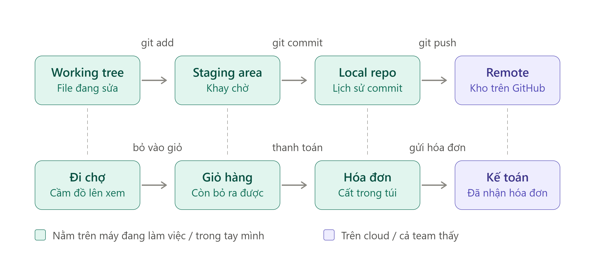
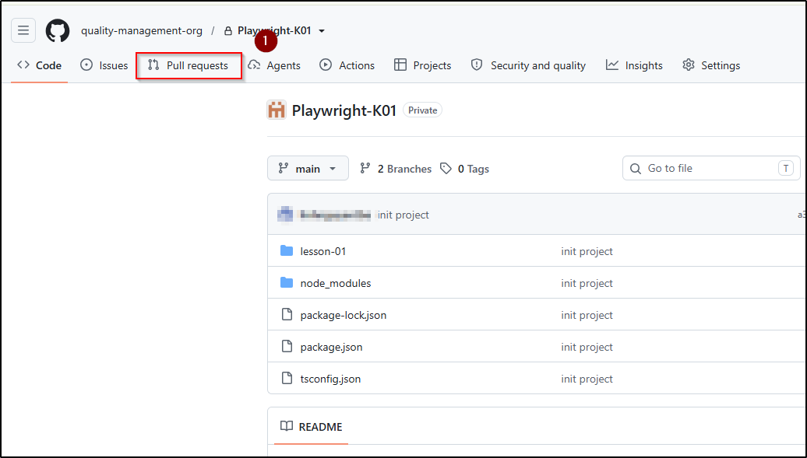
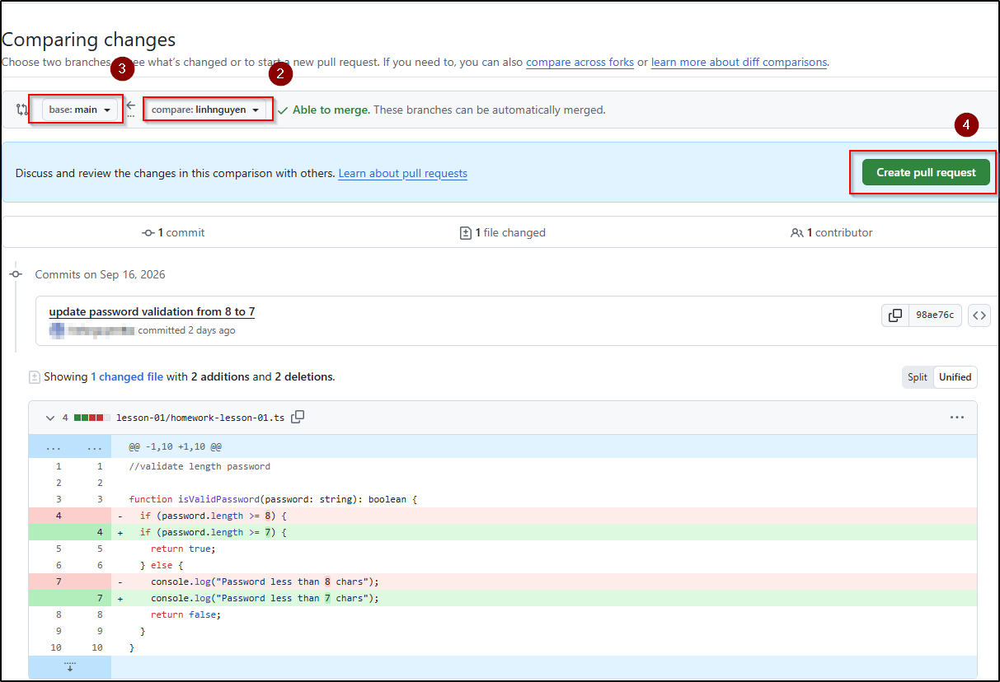

# Buổi 2 · Git cơ bản & Async/Await


**Sau buổi này bạn sẽ:** hiểu và viết được async/await, cơ chế nền tảng của mọi test Playwright, gọi được API thật bằng `fetch`, và tạo được Pull Request đầu tiên trên GitHub theo quy trình của lớp.


## 1. Vì sao cần Async/Await

Khi chương trình gọi API hoặc mở trang web, máy tính gửi yêu cầu đi rồi tiếp tục làm việc khác trong lúc chờ phản hồi, thay vì dừng lại chờ. Cách hoạt động này gọi là bất đồng bộ (asynchronous). Có thể so sánh với việc gọi món ở quán ăn: sau khi gọi món, khách hàng làm việc khác trong lúc chờ, thay vì đứng đợi ở bếp.

Vấn đề phát sinh khi dòng code phía dưới cần kết quả của dòng phía trên (ví dụ cần dữ liệu API trả về để xử lý tiếp). Khi đó chương trình phải có cách chỉ định "chờ kết quả xong rồi mới chạy tiếp". Đó là vai trò của `await`.

Hai từ khóa luôn đi cùng nhau:

* `async` đặt trước hàm: đánh dấu hàm có chứa thao tác cần chờ.
* `await` đặt trước thao tác cần chờ: dòng tiếp theo chỉ chạy khi thao tác này hoàn tất.


Trong Playwright, mọi thao tác với trang web (mở trang, điền form, bấm nút) đều cần chờ, nên `await` xuất hiện ở hầu hết các dòng test. Nắm chắc async/await ở buổi này giúp bạn đọc và viết test Playwright thuận lợi hơn ở các buổi sau.


## 2. Gọi API thật với fetch()

Mở project `playwright-course` của Buổi 1 bằng VS Code (File > Open Folder). Trong Explorer, chuột phải vào vùng trống của project, chọn **New Folder**, đặt tên `lesson-02`. Không cần cài lại thư viện, vì `package.json` và `node_modules/` của project dùng chung cho toàn khóa học. Tạo file `lesson-02/get-users.ts`:

```typescript
async function getUsers() {
  const response = await fetch("https://jsonplaceholder.typicode.com/users");
  const users = await response.json();

  console.log(`Lấy được ${users.length} user`);
  console.log(users[0].name);
}

getUsers();
```

| Dòng code                   | Ý nghĩa                                                            |
| --------------------------- | ------------------------------------------------------------------ |
| `async function getUsers()` | Khai báo hàm có chứa thao tác cần chờ                              |
| `await fetch(...)`          | Gọi API và chờ server phản hồi                                     |
| `await response.json()`     | Chuyển phản hồi thành dữ liệu dùng được. Bước này cũng cần `await` |
| `getUsers();`               | Gọi hàm để chương trình thực sự chạy                               |

Chạy từ gốc project bằng `npx tsx lesson-02/get-users.ts`. Kết quả mong đợi:

```
Lấy được 10 user
Leanne Graham
```


**Lỗi phổ biến nhất của người mới: quên `await`.** Nếu `console.log` in ra `Promise { <pending> }` thay vì dữ liệu, chương trình đã dùng kết quả trước khi thao tác hoàn tất. Kiểm tra lại các vị trí thiếu `await`, đặc biệt là dòng `response.json()`.


**Promise là gì?** Promise là object mà một thao tác bất đồng bộ trả về ngay lập tức, đại diện cho kết quả sẽ có trong tương lai. `await` tạm dừng hàm cho đến khi Promise hoàn tất và trả về giá trị thật. Trong khóa này chỉ dùng cú pháp async/await, không dùng cách viết `.then()`.

## 3. Xử lý lỗi với try/catch

Đoạn code ở mục 2 chạy tốt khi mọi thứ thuận lợi. Nếu mất mạng, sai địa chỉ hoặc server không phản hồi, dòng `await fetch(...)` phát sinh (throw) một lỗi và chương trình dừng ngay tại đó, kèm một đoạn thông báo lỗi dài trên terminal. Thử trực tiếp: đổi URL thành `https://api.khong-ton-tai.com/users` rồi chạy lại. Terminal in ra `TypeError: fetch failed` và chương trình kết thúc với lỗi.

Trong test automation, cách xử lý mong muốn là bắt được lỗi, ghi lại thông tin và kết thúc có kiểm soát. TypeScript cung cấp cú pháp `try/catch` cho việc này:

```typescript
try {
  // các dòng code có thể gặp lỗi
} catch (error) {
  // chỉ chạy khi một dòng trong khối try gặp lỗi
}
```

| Thành phần              | Ý nghĩa                                                                                                                                              |
| ----------------------- | ---------------------------------------------------------------------------------------------------------------------------------------------------- |
| `try { ... }`           | Khối code cần theo dõi. Các dòng chạy bình thường cho đến khi có dòng gặp lỗi                                                                        |
| `catch (error) { ... }` | Khi một dòng trong `try` gặp lỗi, các dòng còn lại trong `try` bị bỏ qua và chương trình chuyển sang khối này. Biến `error` chứa thông tin về lỗi đó |

Áp dụng vào hàm `getUsers()`:

```typescript
async function getUsers() {
  try {
    const response = await fetch("https://jsonplaceholder.typicode.com/users");
    const users = await response.json();

    console.log(`Lấy được ${users.length} user`);
    console.log(users[0].name);
  } catch (error) {
    console.error("Gọi API thất bại:", error);
  }
}

getUsers();
```

Với URL đúng, kết quả không thay đổi so với mục 2. Với URL sai, terminal in ra dòng `Gọi API thất bại:` kèm thông tin lỗi, và chương trình kết thúc bình thường thay vì dừng đột ngột.


Nếu buổi học chưa kịp đi qua mục này, bạn có thể đọc trước để tham khảo. Bài tập buổi này chỉ bắt buộc dùng `if / else` với `response.ok`, phần try/catch là không bắt buộc và sẽ được ôn lại ở buổi sau. Từ sau buổi đó, mọi hàm gọi API đều cần có try/catch và đây là một tiêu chí trainer review khi chấm bài.


## 4. Git là gì

Git là hệ thống quản lý phiên bản: lưu lại lịch sử mọi thay đổi của code, cho phép quay lại phiên bản cũ và nhiều người cùng làm việc trên một project. Các khái niệm cần nắm:

| Thuật ngữ         | Ý nghĩa                                                                        |
| ----------------- | ------------------------------------------------------------------------------ |
| Repository (repo) | Nơi chứa toàn bộ code và lịch sử thay đổi                                      |
| Commit            | Một mốc lưu thay đổi, kèm mô tả ngắn                                           |
| Branch (nhánh)    | Bản làm việc riêng, thay đổi trên nhánh này không ảnh hưởng đến nhánh khác     |
| Push              | Đẩy commit từ máy của bạn lên GitHub                                           |
| Pull Request (PR) | Yêu cầu gộp nhánh của bạn vào nhánh chính, kèm bước review của người khác      |

## 5. Quy trình nộp bài của lớp

Lớp dùng chung một repo GitHub. Bài tập được nộp bằng cách đưa project `playwright-course` vào repo này.

### Bước 1: tải repo lớp về máy (chỉ làm lần đầu)

1. Mở VS Code, chọn File > Open Folder, chọn folder Documents (hoặc nơi bạn muốn lưu repo lớp).
2. Mở Terminal > New Terminal và chạy lệnh sau. Lệnh này tải toàn bộ repo (code và lịch sử) về một folder mới cùng tên repo, nằm trong Documents.

   ```bash
   git clone <class-repo-url>
   ```

### Bước 2: đưa project vào repo lớp (chỉ làm lần đầu)

1. Dùng File Explorer hoặc Finder, di chuyển nguyên folder `playwright-course` (kể cả `node_modules/`) vào folder `students/<your-name>/` trong repo lớp vừa tải về. Sau bước này, project chỉ còn một bản duy nhất nằm trong repo lớp.
2. Trong VS Code, chọn File > Open Folder và mở đúng folder `playwright-course` bên trong repo. Từ Buổi 2 trở đi, luôn mở project theo cách này.

Cấu trúc project sau khi di chuyển:

```
playwright-course/
├── node_modules/
├── lesson-01/
├── lesson-02/
├── .gitignore
├── package.json
├── package-lock.json
└── tsconfig.json
```


Git tự tìm folder `.git` ở các cấp thư mục phía trên, nên mọi lệnh Git chạy được ngay trong folder `playwright-course` mà không cần chuyển ra gốc repo. `git add .` khi đó chỉ đưa các file trong project của bạn vào commit, không ảnh hưởng đến folder của học viên khác.


### Bước 3: tạo nhánh, commit và push

Mở Terminal > New Terminal trong cửa sổ project và chạy lần lượt:

```bash
# Tạo nhánh riêng theo quy ước your-name/lesson-X
git checkout -b linh/lesson-2

# Đưa các file thay đổi vào danh sách chờ commit
git add .

# Lưu mốc thay đổi kèm mô tả ngắn
git commit -m "lesson 2: async await homework"

# Đẩy nhánh lên GitHub
git push -u origin linh/lesson-2
```

| Lệnh                               | Ý nghĩa                                                                                     |
| ---------------------------------- | ------------------------------------------------------------------------------------------- |
| `git checkout -b linh/lesson-2`    | Tạo nhánh mới tên `linh/lesson-2` và chuyển sang nhánh đó. Thay `linh` bằng tên của bạn     |
| `git add .`                        | Đưa mọi file đã thay đổi trong folder hiện tại (project của bạn) vào danh sách chờ commit, trừ những gì `.gitignore` liệt kê |
| `git commit -m "..."`              | Lưu một mốc thay đổi kèm mô tả ngắn bằng tiếng Anh                                          |
| `git push -u origin linh/lesson-2` | Đẩy nhánh lên GitHub. Cờ `-u` liên kết nhánh trên máy với nhánh trên GitHub cho các lần sau |




Kiểm tra trước khi commit bằng `git status`: danh sách file chỉ gồm các file trong `playwright-course/`, không có file nào thuộc `node_modules/`.


**Vì sao không push thẳng vào `main`?** Nhánh `main` của lớp được bật branch protection: mọi thay đổi bắt buộc đi qua Pull Request và được review. Đây cũng là quy trình phổ biến ở phần lớn công ty, nên bạn đang thực hành quy trình thật ngay từ buổi thứ hai.



**Personal Access Token:** GitHub không chấp nhận mật khẩu tài khoản khi push từ terminal. Nếu Git yêu cầu username và password, dùng Personal Access Token thay cho password (tạo tại GitHub > Settings > Developer settings > Personal access tokens). Token chỉ hiển thị một lần khi tạo, cần lưu lại ở nơi an toàn.


<!-- TODO(image): Trang GitHub > Settings > Developer settings > Personal access tokens (Tokens classic), nút Generate new token được khoanh. Che mọi token đang hiển thị. -->

## 6. Tạo Pull Request trên GitHub

1. Mở repo lớp trên GitHub, chọn tab **Pull requests** ở thanh menu phía trên.

   

2. Bấm nút **New pull request** ở góc phải.
3. Ở hàng chọn nhánh, giữ `base: main` và mở danh sách `compare:` để chọn nhánh của bạn, ví dụ `linh/lesson-2`. Phần dưới trang hiển thị các commit và file thay đổi để bạn kiểm tra lại trước khi tạo PR.
4. Bấm **Create pull request**. GitHub chuyển sang form nhập nội dung.

   

5. Đặt tiêu đề rõ ràng, ví dụ: `[Linh] Lesson 2 - Async/Await`.
6. Bấm **Create pull request** lần nữa để hoàn tất.

   <!-- TODO(image): Form tạo Pull Request: base là main, compare là linh/lesson-2, ô tiêu đề điền "[Linh] Lesson 2 - Async/Await", nút Create pull request được khoanh. -->

7. Chờ trainer review. Nếu có comment, sửa code rồi push lại lên đúng nhánh đó, PR tự cập nhật.


Ngay sau khi push, GitHub có thể hiện banner màu vàng kèm nút **Compare & pull request** ở đầu trang repo. Bấm nút đó là lối tắt, chuyển thẳng tới bước 4. Banner chỉ xuất hiện trong ít phút, nếu không thấy thì dùng tab **Pull requests** theo các bước trên.


## 7. Lỗi thường gặp

| Triệu chứng                                  | Nguyên nhân                                    | Cách xử lý                                                                    |
| -------------------------------------------- | ---------------------------------------------- | ----------------------------------------------------------------------------- |
| Log ra `Promise { <pending> }`               | Quên `await`                                   | Thêm `await` trước `fetch` hoặc `response.json()`                             |
| Lỗi "await is only valid in async functions" | Dùng `await` ngoài hàm async                   | Thêm `async` vào khai báo hàm                                                 |
| Push bị từ chối (rejected)                   | Đang đứng ở nhánh `main`                       | Kiểm tra nhánh bằng `git branch`, tạo nhánh riêng rồi push lại                |
| Lỗi "Authentication failed" khi push         | Dùng mật khẩu tài khoản thay vì token          | Tạo Personal Access Token và dùng token ở ô password                          |
| Không tìm thấy nhánh của mình trong ô `compare` | Nhánh chưa được push lên GitHub                | Chạy lại `git push -u origin your-name/lesson-2`, tải lại trang rồi mở lại danh sách nhánh |
| `git status` liệt kê hàng nghìn file trong `node_modules/` | Thiếu file `.gitignore` trong `playwright-course` | Tạo `.gitignore` theo mục 2 của Buổi 1, chạy `git rm -r --cached node_modules` rồi `git add .` lại |

## 8. Bài tập về nhà

### Bài 1: gọi API và kiểm tra kết quả trả về

Tạo file `lesson-02/homework-lesson-02.ts`, viết hàm `getProducts()`:

* Gọi API `https://fakestoreapi.com/products`
* Kiểm tra `response.ok`, nếu là `false` thì log thông báo lỗi kèm `response.status` rồi dừng hàm
* Nếu thành công, log tổng số sản phẩm và tên sản phẩm đầu tiên (field `title`)

Chạy bằng `npx tsx lesson-02/homework-lesson-02.ts`.

Để kiểm tra nhánh lỗi, đổi tạm URL thành `https://fakestoreapi.com/product` (thiếu chữ `s`). Server trả về status 404, `response.ok` là `false`, và hàm phải log thông báo lỗi thay vì đọc dữ liệu.


`response.ok` là một thuộc tính có sẵn của `response`, kiểu `boolean`, viết không kèm dấu ngoặc. Giá trị là `true` khi status nằm trong khoảng 200-299 và `false` với các status còn lại.


### Bài 2: ôn lại vòng lặp và destructuring của Buổi 1

Tạo file `lesson-01/practice-lesson-01.ts`, viết hàm `countLoginResults()`:

```typescript
function countLoginResults(
  accounts: { username: string; canLogin: boolean }[]
): { passed: number; failed: number } {
  // duyệt array bằng for...of, đếm và trả về object gồm 2 field
}
```

* Duyệt array bằng vòng lặp `for...of`
* Đếm số tài khoản có `canLogin` là `true` và số tài khoản có `canLogin` là `false`
* Trả về một object gồm hai field `passed` và `failed`
* Chạy thử với array `accounts` ở mục 8 của Buổi 1, dùng destructuring để lấy hai giá trị ra hai biến rồi log theo dạng `"Passed: 2, Failed: 2"`

Hàm này không gọi API nên chạy được ngay, không cần `async/await`.

### Bài 3: nộp bài qua Pull Request

Đưa project `playwright-course` (gồm `lesson-01` và `lesson-02`) vào repo lớp theo mục 5, tạo Pull Request trên nhánh `your-name/lesson-2` theo mục 6.

### Bài 4 (không bắt buộc): try/catch

Nếu bạn đã đọc mục 3, bọc thêm phần gọi API của bài 1 trong `try/catch`. Phần này sẽ được ôn lại ở buổi sau, chưa tính vào tiêu chí chấm bài.

**Checklist trước khi nộp:**

* [ ] Cả hai file chạy được bằng `npx tsx`
* [ ] Bài 1 kiểm tra `response.ok` bằng `if / else`
* [ ] Bài 1 chạy đúng cả khi URL sai (log lỗi, không crash)
* [ ] Bài 2 dùng `for...of` và destructuring
* [ ] Mọi tham số và giá trị trả về đều có khai báo kiểu
* [ ] Không dùng `any`
* [ ] Tên hàm và biến đúng camelCase
* [ ] Đúng quy ước tên nhánh `your-name/lesson-2`
* [ ] PR có tiêu đề rõ ràng
